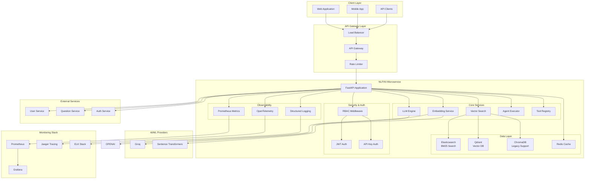
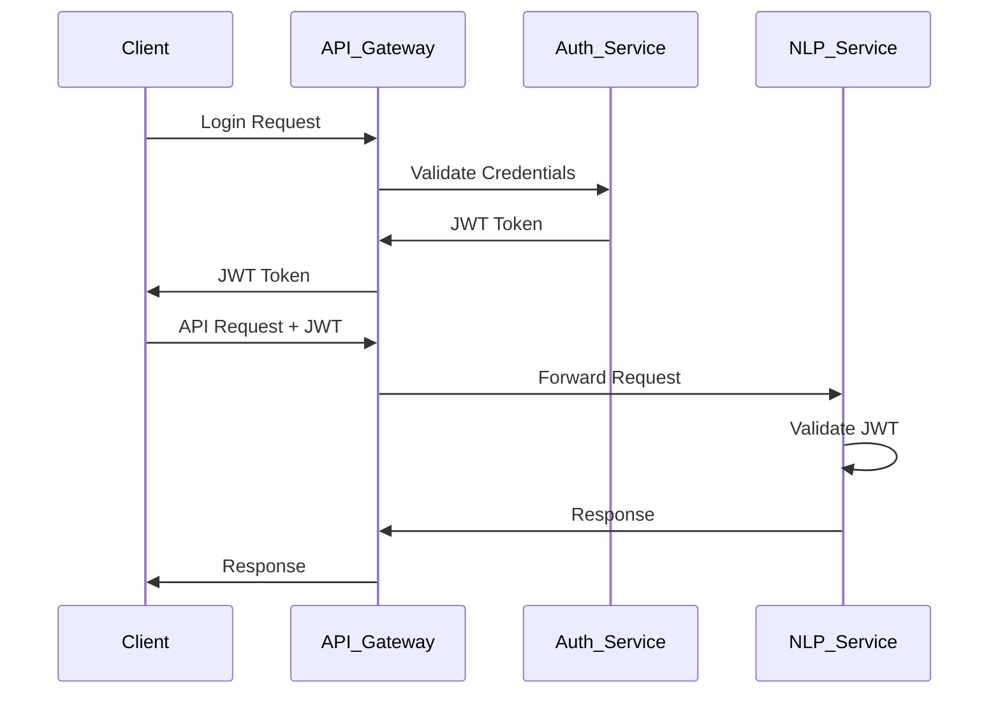
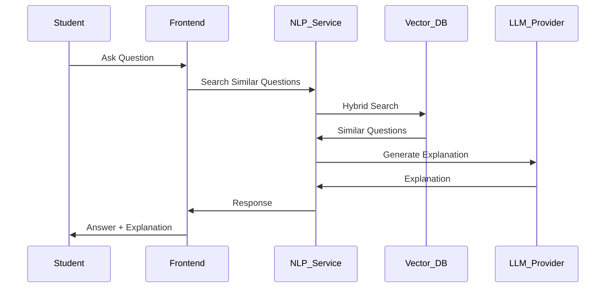
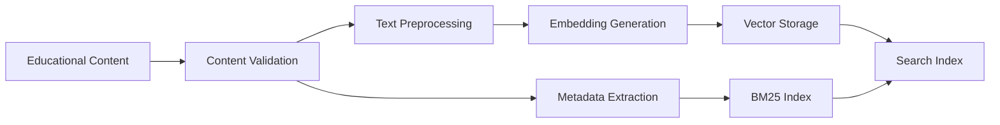
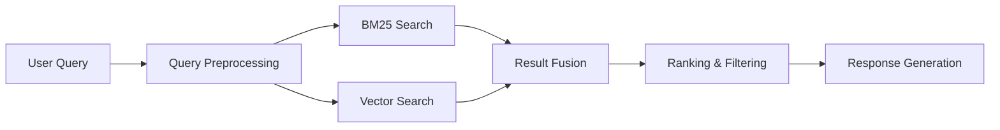

# NLP/AI Microservice

A modular FastAPI microservice for Natural Language Processing (NLP) and Artificial Intelligence (AI) operations. This service provides a comprehensive suite of AI capabilities including text generation, embeddings, vector search, agent execution, and tool management.

## 🏗️ Architecture

The NLP/AI Microservice follows a modular, microservices-oriented architecture designed for educational content processing with SAT/UTBK data. The system integrates multiple AI/ML components with robust security, observability, and scalability features.

### System Architecture Diagram



### Directory Structure

```
nlp-ai-microservice/
├── main.py                     # FastAPI application entry point
├── requirements.txt            # Python dependencies
├── Dockerfile                  # Container configuration
├── docker-compose.yml          # Multi-service orchestration
├── README.md                   # This documentation
├── pytest.ini                 # Test configuration
├── openapi_schema.py          # OpenAPI schema definitions
├── orchestrator_service.py    # Service orchestration
├── docs/                      # Documentation
│   └── api/                   # API documentation
│       ├── openapi.json       # OpenAPI specification
│       ├── redoc.html         # Interactive API docs
│       ├── postman_collection.json
│       └── api_examples.json
├── llm_engine/                # Large Language Model operations
│   ├── __init__.py
│   └── llm_service.py         # Multi-provider LLM integration
├── embedding_model/           # Text embedding generation
│   ├── __init__.py
│   └── embedding_service.py   # Sentence transformers & OpenAI embeddings
├── vector_db/                 # Vector database operations
│   ├── __init__.py
│   ├── vector_service.py      # ChromaDB integration
│   ├── elasticsearch_service.py # Elasticsearch BM25 search
│   ├── qdrant_service.py      # Qdrant vector search
│   └── hybrid_retriever.py    # Hybrid search implementation
├── agent_executor/            # AI agent orchestration
│   ├── __init__.py
│   └── agent_service.py       # LangChain agent management
├── tools/                     # Utility tools for agents
│   ├── __init__.py
│   └── tool_registry.py       # Tool registry & implementations
├── clients/                   # External service clients
│   ├── __init__.py
│   ├── api_clients.py         # Async REST clients
│   ├── grpc_clients.py        # gRPC clients
│   └── service_discovery.py   # Service discovery
├── auth/                      # Authentication & authorization
│   ├── __init__.py
│   ├── auth_service.py        # Authentication service
│   ├── api_key_middleware.py  # API key middleware
│   ├── rbac_middleware.py     # RBAC middleware
│   ├── dependencies.py        # Auth dependencies
│   ├── models.py              # User & permission models
│   ├── api_keys_config.json   # API key configuration
│   └── rbac_config.json       # RBAC configuration
├── middleware/                # Custom middleware
│   ├── __init__.py
│   └── rate_limit.py          # Rate limiting middleware
├── cache/                     # Caching layer
│   ├── __init__.py
│   └── redis_cache.py         # Redis cache implementation
├── observability/             # Observability & monitoring
│   ├── __init__.py
│   └── otel_setup.py          # OpenTelemetry setup
├── metrics/                   # Metrics collection
│   ├── __init__.py
│   └── prometheus.py          # Prometheus metrics
├── k8s/                       # Kubernetes manifests
│   ├── deployment.yaml        # Application deployment
│   ├── service.yaml           # Service definition
│   └── hpa.yaml               # Horizontal Pod Autoscaler
├── tests/                     # Test suite
│   ├── conftest.py            # Test configuration
│   ├── test_e2e_sat_utbk.py   # End-to-end tests
│   ├── test_simple_e2e.py     # Simple E2E tests
│   ├── test_llm_integration.py # LLM integration tests
│   ├── test_vector_search_educational.py # Vector search tests
│   └── test_hybrid_retriever.py # Hybrid retriever tests
├── scripts/                   # Utility scripts
│   ├── generate_grpc_stubs.py # gRPC stub generation
│   └── generate_openapi_simple.py # OpenAPI doc generation
├── protos/                    # Protocol buffer definitions
│   ├── api_gateway.proto
│   ├── question_service.proto
│   └── user_service.proto
├── grafana/                   # Grafana dashboards
│   └── dashboard.json
├── prometheus.yml             # Prometheus configuration
├── redis.conf                 # Redis configuration
└── env.example                # Environment variables template
```

## 🧩 Module Overview

### 1. LLM Engine (`llm_engine/`)
**Purpose**: Handles Large Language Model operations and text generation using Groq.

**Key Features**:
- Groq provider for fast text generation
- Environment-based configuration
- Text generation with customizable models
- Chat completion with conversation context

**Available Providers & Models**:
- Groq:
  - llama3-8b-8192 (default)
  - llama3-70b-8192
  - mixtral-8x7b-32768
  - gemma-7b-it

**API Endpoints**:
- `POST /llm/generate` - Generate text from prompt
- `POST /llm/chat` - Chat completion with context

### 2. Embedding Model (`embedding_model/`)
**Purpose**: Generates text embeddings for vector operations and similarity search.

**Key Features**:
- Multiple embedding model support
- Batch embedding generation
- Cosine similarity computation
- OpenAI Ada embeddings integration

**Available Models**:
- `all-MiniLM-L6-v2` (default) - Sentence Transformers
- `all-mpnet-base-v2` - MPNet embeddings
- `text-embedding-ada-002` - OpenAI Ada embeddings

**API Endpoints**:
- `POST /embedding/generate` - Generate single embedding
- `POST /embedding/batch` - Generate batch embeddings

### 3. Retrieval (`vector_db/`)
**Purpose**: Manages keyword and vector search, and hybrid retrieval.

**Key Features**:
- ChromaDB integration for vector storage (existing)
- ElasticSearch for BM25 keyword search
- Qdrant for semantic vector search
- Hybrid retriever that merges BM25 and semantic results with tunable weighting
- Document ingestion to all backing stores

**API Endpoints**:
- `POST /ingest` - Bulk ingest texts into Elastic and Qdrant (and Chroma for compatibility)
- `POST /search/hybrid` - Hybrid search over both indexes
- `POST /search/questions` - Hybrid search filtered to `type=question`
- `POST /search/materials` - Hybrid search filtered to `type=material`
- `POST /vector/search` - Legacy Chroma vector search
- `POST /vector/add` - Add a single document to Chroma

### 4. External Services (`clients/`)
**Purpose**: Communicate with User Service, Question Service, and API Gateway via REST (optional gRPC).

**Key Features**:
- Service discovery: explicit URL, Consul, or Istio/K8s DNS
- Async `httpx` clients with timeouts
- gRPC client placeholders for future stubs

**API Endpoints Added**:
- `GET /users/{user_id}` – Fetch user via User Service
- `POST /users/{user_id}/index-questions` – Pull user's questions and index into Elastic+Qdrant
- `GET /gateway/proxy?path=/...&method=GET` – Proxy through API Gateway
- `POST /orchestrate/answer` – Orchestrate: fetch user, retrieve context, call LLM

### 5. Agent Executor (`agent_executor/`)
**Purpose**: Orchestrates AI agents with tool integration using LangChain.

**Key Features**:
- LangChain agent initialization
- Tool integration and execution
- Conversation memory management
- Multi-step reasoning chains

**API Endpoints**:
- `POST /agent/execute` - Execute agent with tools

### 6. Tools (`tools/`)
**Purpose**: Provides utility tools for AI agents to perform various tasks.

**Available Tools**:
- **Calculator**: Mathematical calculations
- **Weather**: Weather information (mock)
- **Web Search**: Web search capabilities (mock)
- **File Read**: File content reading
- **Text Analysis**: Text metrics and analysis
- **DateTime**: Current date/time information
- **Math**: Mathematical operations
- **Text Processing**: Text transformation utilities

**API Endpoints**:
- `GET /tools/list` - List available tools
- `POST /tools/execute` - Execute specific tool

## 🚀 Getting Started

### Prerequisites

- Python 3.11+
- Groq API key (for LLM features)
- Docker (optional, for containerized deployment)

### Environment Setup

1. **Clone the repository**:
   ```bash
   git clone <repository-url>
   cd nlp-ai-microservice
   ```

2. **Create virtual environment**:
   ```bash
   python -m venv venv
   source venv/bin/activate  # On Windows: venv\Scripts\activate
   ```

3. **Install dependencies**:
   ```bash
   pip install -r requirements.txt
   ```

4. **Set up environment variables**:
   Create a `.env` file in the project root:
   ```env
   # Groq configuration
   GROQ_API_KEY=your-groq-key-here
   GROQ_DEFAULT_MODEL=llama3-8b-8192

   # Common settings
   MAX_RETRIES=3
   TEMPERATURE=0.7
   MAX_TOKENS=1000

   # External services (REST)
   USER_SERVICE_URL=http://localhost:9001
   QUESTION_SERVICE_URL=http://localhost:9002
   API_GATEWAY_URL=http://localhost:8080

   # Optional service discovery (Consul/Istio)
   # CONSUL_HOST=localhost
   # CONSUL_PORT=8500
   # USE_ISTIO_DNS=false
   # ISTIO_NAMESPACE=default
   ```

### Running Locally

#### Option 1: Direct Python Execution
```bash
# Start the service
uvicorn main:app --host 0.0.0.0 --port 8000 --reload
```

#### Option 2: Docker Deployment
```bash
# Build the Docker image
docker build -t nlp-ai-microservice .

# Run the container
docker run -p 8000:8000 --env-file .env nlp-ai-microservice
```

### Health Check

Verify the service is running:
```bash
curl http://localhost:8000/health
```

Expected response:
```json
{
  "status": "healthy",
  "service": "nlp-ai-microservice"
}
```

## 📚 API Documentation

Once the service is running, you can access:

- **Interactive API Docs**: http://localhost:8000/docs
- **ReDoc Documentation**: http://localhost:8000/redoc

## 🔧 Usage Examples

### Text Generation with Groq
```python
from llm_engine.llm_service import LLMService
from langchain.schema import HumanMessage, SystemMessage

# Initialize the service
llm_service = LLMService()

# Basic text generation
async def generate_text():
    response = await llm_service.generate_text(
        "Explain quantum computing in simple terms"
    )
    print(response)

# Chat completion
async def chat_with_groq():
    messages = [
        SystemMessage(content="You are a helpful AI assistant."),
        HumanMessage(content="What are the key principles of quantum mechanics?")
    ]
    response = await llm_service.chat_completion(
        messages
    )
    print(response)

# Get available models
models = llm_service.get_available_models()
print(f"Available Groq models: {models}")
```

### Generate Embeddings
```bash
curl -X POST "http://localhost:8000/embedding/generate" \
  -H "Content-Type: application/json" \
  -d '{
    "text": "This is a sample text for embedding",
    "model": "all-MiniLM-L6-v2"
  }'
```

### Vector Search
```bash
curl -X POST "http://localhost:8000/vector/search" \
  -H "Content-Type: application/json" \
  -d '{
    "query": "machine learning algorithms",
    "top_k": 5
  }'
```

### Agent Execution
```bash
curl -X POST "http://localhost:8000/agent/execute" \
  -H "Content-Type: application/json" \
  -d '{
    "query": "Calculate the square root of 144 and then multiply by 3",
    "tools": ["calculator", "math"]
  }'
```

### Tool Execution
```bash
curl -X POST "http://localhost:8000/tools/execute" \
  -H "Content-Type: application/json" \
  -d '{
    "tool_name": "text_analysis",
    "parameters": {
      "text": "This is a sample text for analysis."
    }
  }'
```

## 🧪 Testing

Run the test suite:
```bash
pytest
```

## 🔍 Monitoring and Logging

The service includes comprehensive observability:
- Application logs are structured JSON, ELK-friendly (Logstash/Fluent Bit ingestion)
- OpenTelemetry tracing with optional OTLP export (`OTEL_EXPORTER_OTLP_ENDPOINT`)
- Prometheus metrics exposed at `/metrics` via Instrumentator
- Sample Grafana dashboard at `grafana/dashboard.json`

### Configure OpenTelemetry (optional)
- Set `SERVICE_NAME` (default `nlp-ai-microservice`)
- Set `OTEL_EXPORTER_OTLP_ENDPOINT` (e.g., `http://otel-collector:4318/v1/traces`)
- Optional namespace: `OTEL_SERVICE_NAMESPACE`

### Structured JSON logging
- `LOG_LEVEL` controls verbosity (default `INFO`)
- `ENVIRONMENT` annotates log records (e.g., `development`, `production`)

### Prometheus metrics
- Endpoint: `/metrics` (configurable via `PROMETHEUS_METRICS_ENDPOINT`)
- Kubernetes Service has scrape annotations pre-configured

### Grafana
- Import `grafana/dashboard.json` in Grafana to visualize RPS, latencies, in-progress, and 429s

## 🔒 Security & Authentication

### Role-Based Access Control (RBAC)

The microservice implements comprehensive RBAC with three main roles:

- **Admin**: Full system access with all permissions
- **Teacher**: Educational content and course management
- **Student**: Limited access for learning and content consumption

#### Authentication Methods

1. **JWT Token Authentication**
   - Integration with external Auth Service
   - Token verification and user role validation
   - Support for token refresh and revocation

2. **API Key Authentication**
   - Role-based API key access for external integrations
   - Configurable permissions per API key
   - Support for key expiration and usage tracking

#### Key Features

- **Automatic Route Protection**: Middleware-based access control
- **Fine-grained Permissions**: Granular permission system
- **Flexible Configuration**: JSON-based RBAC configuration
- **Token Caching**: Performance optimization with configurable TTL
- **Development Mode**: Mock authentication for testing

#### Configuration

```bash
# Auth Service
AUTH_SERVICE_URL=http://localhost:9000
AUTH_CACHE_ENABLED=true
AUTH_CACHE_TTL_SECONDS=300

# RBAC Configuration
RBAC_CONFIG_FILE=auth/rbac_config.json

# API Keys
EXTERNAL_API_KEYS=admin-key-12345,teacher-key-67890
EXTERNAL_API_KEYS_FILE=auth/api_keys_config.json
```

#### Example Protected Routes

```python
# Admin-only endpoint
@app.get("/admin/dashboard")
async def admin_dashboard(user: User = Depends(require_admin)):
    return {"message": "Welcome admin"}

# Teacher and Admin access
@app.get("/teacher/dashboard") 
async def teacher_dashboard(user: User = Depends(require_teacher_or_admin)):
    return {"message": "Welcome teacher"}

# Permission-based access
@app.post("/courses")
async def create_course(user: User = Depends(require_permissions(Permission.CREATE_COURSE))):
    return {"message": "Course created"}
```

For detailed RBAC documentation, see [RBAC_DOCUMENTATION.md](RBAC_DOCUMENTATION.md).

### Security Considerations

- **API Key Management**: Store API keys securely in environment variables
- **Input Validation**: All inputs are validated using Pydantic models
- **Error Handling**: Comprehensive error handling prevents information leakage
- **CORS**: Configured for development (adjust for production)
- **Rate Limiting**: Redis-backed global rate limiter
  - Env vars: `RATE_LIMIT_REQUESTS` (default 100), `RATE_LIMIT_WINDOW_SECONDS` (default 60)
  - Exempt paths: `RATE_LIMIT_EXEMPT_PATHS` (default `/health,/metrics,/docs,/openapi.json,/redoc`)
- **TLS**: Inbound and outbound support
  - Inbound (uvicorn): set `TLS_CERT_FILE` and `TLS_KEY_FILE` to enable HTTPS
  - Outbound (httpx clients):
    - `OUTBOUND_TLS_VERIFY`: `true|false`
    - `OUTBOUND_CA_BUNDLE`: path to CA bundle file for verification
    - `OUTBOUND_CLIENT_CERT` and `OUTBOUND_CLIENT_KEY` for mTLS

## 🚀 Production Deployment

### Prerequisites

- **Docker & Docker Compose**: For containerized deployment
- **Kubernetes**: For production orchestration (optional)
- **Groq API Key**: For LLM functionality
- **Redis**: For caching and rate limiting
- **Elasticsearch**: For BM25 search (optional)
- **Qdrant**: For vector search (optional)

### Environment Configuration

Create a `.env` file with the following variables:

```env
# Core API Keys
GROQ_API_KEY=your_production_groq_key

# Service Configuration
SERVICE_NAME=nlp-ai-microservice
LOG_LEVEL=INFO
ENVIRONMENT=production
```

### Kubernetes Deployment

#### 1. Create Secrets

```bash
# Create namespace
kubectl create namespace nlp-ai

# Create secrets
kubectl create secret generic nlp-ai-secrets \
  --from-literal=GROQ_API_KEY=your_groq_key \
  --namespace=nlp-ai
```

#### 2. Deploy Application

```bash
# Deploy application
kubectl apply -f k8s/deployment.yaml -n nlp-ai

# Deploy service
kubectl apply -f k8s/service.yaml -n nlp-ai

# Deploy HPA (Horizontal Pod Autoscaler)
kubectl apply -f k8s/hpa.yaml -n nlp-ai
```

#### 3. Verify Deployment

```bash
# Check pods
kubectl get pods -n nlp-ai

# Check services
kubectl get services -n nlp-ai

# Check HPA
kubectl get hpa -n nlp-ai

# View logs
kubectl logs -f deployment/nlp-ai-microservice -n nlp-ai
```

### Production Considerations

#### Security
- **API Keys**: Store in Kubernetes secrets or external secret management
- **TLS**: Enable TLS for production deployments
- **Network Policies**: Implement Kubernetes network policies
- **RBAC**: Configure proper role-based access control

#### Scaling
- **Horizontal Scaling**: Use HPA for automatic scaling based on CPU/memory
- **Vertical Scaling**: Adjust resource limits based on usage patterns
- **Database Scaling**: Consider Redis Cluster for high availability
- **Load Balancing**: Use ingress controllers for external access

#### Monitoring
- **Metrics**: Prometheus metrics exposed at `/metrics`
- **Logging**: Structured JSON logs for ELK stack
- **Tracing**: OpenTelemetry integration for distributed tracing
- **Health Checks**: Built-in health check endpoints

#### Backup & Recovery
- **Redis**: Configure Redis persistence
- **Vector Data**: Backup Qdrant collections
- **Configuration**: Version control all configuration files

## 🔗 Integration Guide

### Backend Microservices Integration

The NLP/AI microservice is designed to integrate seamlessly with other backend microservices in an educational platform.

#### 1. User Service Integration

```python
# Example: Get user profile for personalized recommendations
from clients.api_clients import UserServiceClient

user_client = UserServiceClient()
user_profile = await user_client.get_user_profile(user_id)
study_preferences = user_profile.get("study_preferences", {})
```

**Integration Points:**
- User authentication and authorization
- Student profile management
- Study preferences and goals
- Progress tracking

#### 2. Question Service Integration

```python
# Example: Index user's questions for search
from clients.api_clients import QuestionServiceClient

question_client = QuestionServiceClient()
questions = await question_client.get_user_questions(user_id, limit=50)

# Index questions for hybrid search
for question in questions:
    await ingest_documents([question["text"]], [{"type": "question", "user_id": user_id}])
```

**Integration Points:**
- Question retrieval and indexing
- Answer validation
- Question difficulty analysis
- Performance analytics

#### 3. API Gateway Integration

```python
# Example: Proxy requests through API Gateway
from clients.api_clients import APIGatewayClient

gateway_client = APIGatewayClient()
response = await gateway_client.proxy(method="GET", path="/users/profile")
```

**Integration Points:**
- Request routing and load balancing
- Rate limiting and throttling
- Authentication and authorization
- Request/response transformation

### Frontend Integration

#### 1. Web Application Integration

```javascript
// Example: SAT math problem explanation
const explainProblem = async (problemText) => {
  const response = await fetch('/llm/generate', {
    method: 'POST',
    headers: {
      'Content-Type': 'application/json',
      'Authorization': `Bearer ${jwtToken}`
    },
    body: JSON.stringify({
      text: `Explain how to solve this SAT math problem: ${problemText}`,
      model: 'gpt-3.5-turbo'
    })
  });
  
  const data = await response.json();
  return data.response;
};
```

#### 2. Mobile App Integration

```javascript
// Example: Hybrid search for study materials
const searchMaterials = async (query) => {
  const response = await fetch('/search/materials', {
    method: 'POST',
    headers: {
      'Content-Type': 'application/json',
      'Authorization': `Bearer ${jwtToken}`
    },
    body: JSON.stringify({
      query: query,
      top_k: 10,
      alpha: 0.6,
      filter: { subject: 'math', difficulty: 'medium' }
    })
  });
  
  const data = await response.json();
  return data.results;
};
```

### API Integration Patterns

#### 1. Authentication Flow



#### 2. Educational Content Processing Flow



### Data Flow Architecture

#### 1. Content Ingestion Pipeline



#### 2. Search and Retrieval Pipeline



### Performance Optimization

#### 1. Caching Strategy

- **Redis Cache**: Cache frequently accessed data
- **Embedding Cache**: Cache generated embeddings
- **Search Results**: Cache popular search queries
- **User Sessions**: Cache user preferences and history

#### 2. Database Optimization

- **Vector Indexing**: Optimize Qdrant collections
- **BM25 Tuning**: Fine-tune Elasticsearch settings
- **Connection Pooling**: Optimize database connections
- **Query Optimization**: Use efficient search queries

#### 3. API Optimization

- **Rate Limiting**: Implement intelligent rate limiting
- **Request Batching**: Batch multiple requests
- **Async Processing**: Use async/await patterns
- **Response Compression**: Enable gzip compression

### Error Handling and Resilience

#### 1. Circuit Breaker Pattern

```python
# Example: LLM provider fallback
class LLMService:
    async def generate_text(self, text, model):
        try:
            return await self.openai_provider.generate(text, model)
        except Exception:
            # Fallback to another provider
            return await self.another_provider.generate(text, model)
```

#### 2. Retry Logic

```python
# Example: Retry with exponential backoff
import asyncio
from tenacity import retry, stop_after_attempt, wait_exponential

@retry(stop=stop_after_attempt(3), wait=wait_exponential(multiplier=1, min=4, max=10))
async def call_external_service():
    # External service call
    pass
```

#### 3. Health Checks

```python
# Example: Comprehensive health check
@app.get("/health")
async def health_check():
    health_status = {
        "status": "healthy",
        "timestamp": datetime.utcnow().isoformat(),
        "services": {
            "redis": await check_redis_health(),
            "elasticsearch": await check_elasticsearch_health(),
            "qdrant": await check_qdrant_health(),
            "llm_providers": await check_llm_providers_health()
        }
    }
    return health_status
```

## 🤝 Contributing

1. Fork the repository
2. Create a feature branch
3. Make your changes
4. Add tests for new functionality
5. Submit a pull request

## 📄 License

This project is licensed under the MIT License - see the LICENSE file for details.

## 🆘 Support

For issues and questions:
1. Check the API documentation at `/docs`
2. Review the logs for error details
3. Ensure all environment variables are set correctly
4. Verify OpenAI API key validity and quota

---

**Note**: This microservice is designed for development and testing. For production use, consider additional security measures, monitoring, and scaling strategies.
